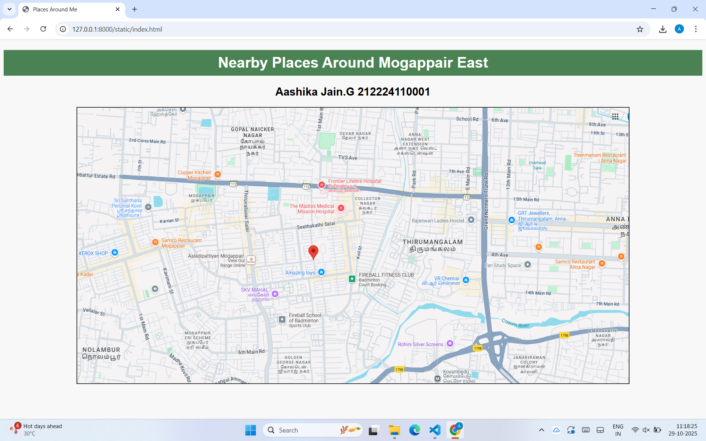
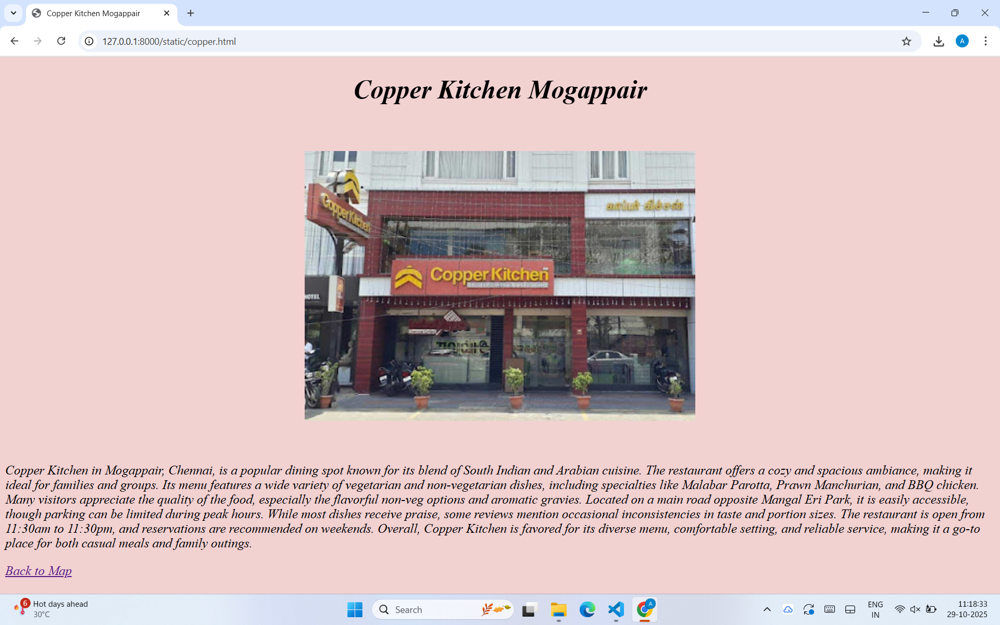
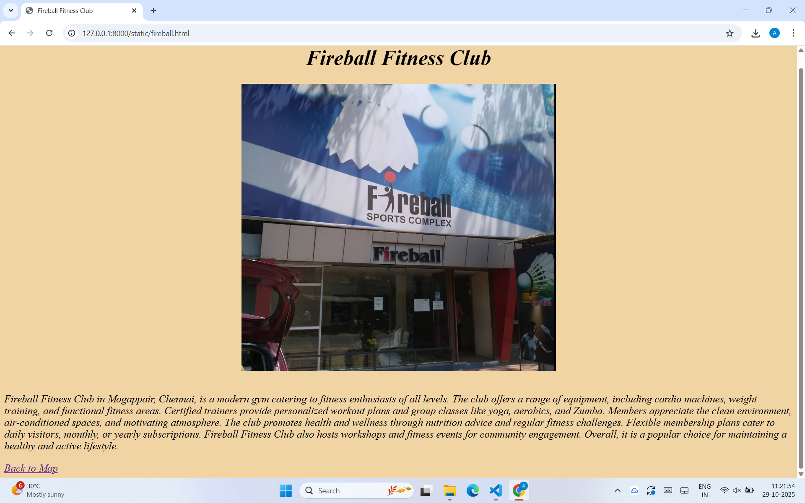
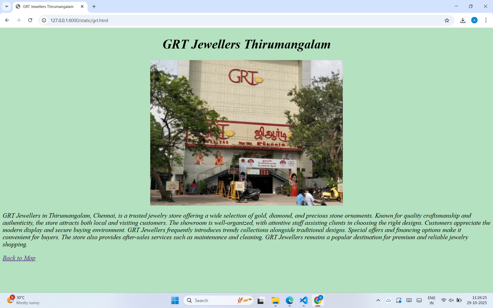
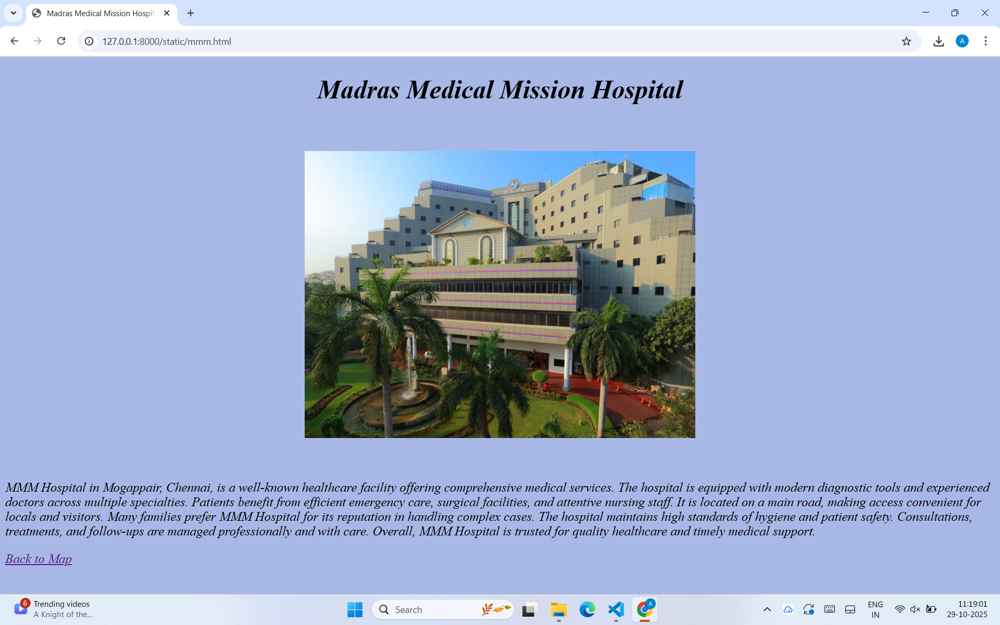
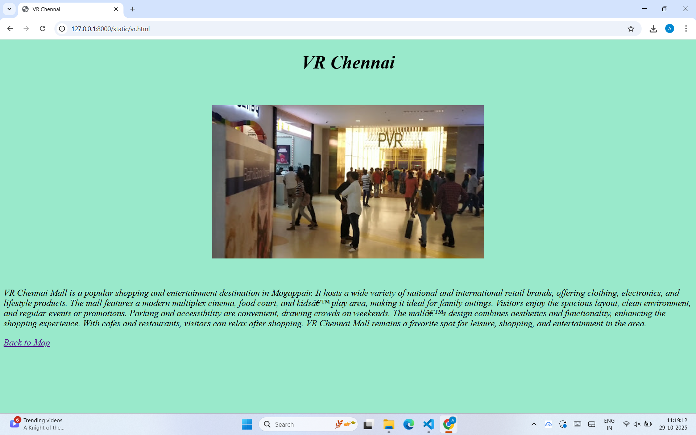
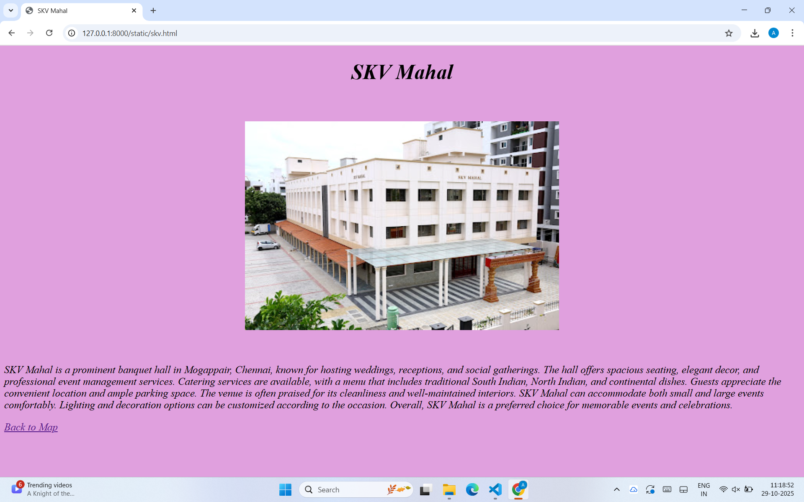

# Ex04 Places Around Me
## Date: 29-10-2025
## Name : AASHIKA JAIN.G (212224110001)

## AIM
To develop a website to display details about the places around my house.

## DESIGN STEPS

### STEP 1
Create a Django admin interface.

### STEP 2
Download your city map from Google.

### STEP 3
Using ```<map>``` tag name the map.

### STEP 4
Create clickable regions in the image using ```<area>``` tag.

### STEP 5
Write HTML programs for all the regions identified.

### STEP 6
Execute the programs and publish them.

## CODE
index.html
```
<!DOCTYPE html>
<html>
<head>
  <title>Places Around Me</title>
  <style>
    body {
      font-family: Arial;
      background: #f8f8f8;
      text-align: center;
    }
    h1 {
      background: #4a8254;
      color: white;
      padding: 10px;
    }
    img {
      border: 2px solid #333;
      width: 1200px;
      height: 600px;
    }
  </style>
</head>
<body>
  <h1>Nearby Places Around Mogappair East</h1>
  <h2>Aashika Jain.G 212224110001</h2>

  
  <map name="places">
    <area shape="circle" coords="1090,480,40" href="vr.html" alt="VR Chennai">
    <area shape="rect" coords="1010,350,1120,400" href="grt.html" alt="GRT Jewellers Thirumangalam">
    <area shape="rect" coords="450,500,550,560" href="skv.html" alt="SKV Mahal">
    <area shape="rect" coords="620,480,740,540" href="fireball.html" alt="Fireball Fitness Club">
    <area shape="rect" coords="900,260,1030,320" href="mmm.html" alt="Madras Medical Mission Hospital">
    <area shape="circle" coords="400,220,40" href="copper.html" alt="Copper Kitchen Mogappair">
  </map>
</body>
</html>
```
copper.html
```
<!DOCTYPE html>
<html>
<head><title>Copper Kitchen Mogappair</title></head>
<style>
    body {
      background-color: #f2d1d1;
      font-style: italic;        
      font-size: 20px; 
    }
  </style>
<body>
<h1 align="center">Copper Kitchen Mogappair</h1>
<br><br>

<br><br>
<p>Copper Kitchen in Mogappair, Chennai, is a popular dining spot known for its blend of South Indian and Arabian cuisine. The restaurant offers a cozy and spacious ambiance, making it ideal for families and groups. Its menu features a wide variety of vegetarian and non-vegetarian dishes, including specialties like Malabar Parotta, Prawn Manchurian, and BBQ chicken. Many visitors appreciate the quality of the food, especially the flavorful non-veg options and aromatic gravies. Located on a main road opposite Mangal Eri Park, it is easily accessible, though parking can be limited during peak hours. While most dishes receive praise, some reviews mention occasional inconsistencies in taste and portion sizes. The restaurant is open from 11:30am to 11:30pm, and reservations are recommended on weekends. Overall, Copper Kitchen is favored for its diverse menu, comfortable setting, and reliable service, making it a go-to place for both casual meals and family outings.
</p>
<a href="index.html"> Back to Map</a>
</body>
</html>
```
fireball.html
```
<!DOCTYPE html>
<html>
<head><title>Fireball Fitness Club</title></head>
<style>
    body {
      background-color: #f1d4a4;
      font-style: italic;        
      font-size: 20px;
    }
  </style>
<body>
<h1 align="center">Fireball Fitness Club</h1>

<br>
<p>Fireball Fitness Club in Mogappair, Chennai, is a modern gym catering to fitness enthusiasts of all levels. The club offers a range of equipment, including cardio machines, weight training, and functional fitness areas. Certified trainers provide personalized workout plans and group classes like yoga, aerobics, and Zumba. Members appreciate the clean environment, air-conditioned spaces, and motivating atmosphere. The club promotes health and wellness through nutrition advice and regular fitness challenges. Flexible membership plans cater to daily visitors, monthly, or yearly subscriptions. Fireball Fitness Club also hosts workshops and fitness events for community engagement. Overall, it is a popular choice for maintaining a healthy and active lifestyle.</p>
<a href="index.html">Back to Map</a>
</body>
</html>
```
grt.html
```
<!DOCTYPE html>
<html>
<head><title>GRT Jewellers Thirumangalam</title></head>
<body>
    <style>
    body {
      background-color: #b4e1bf;
      font-style: italic;        
      font-size: 20px;
    }
  </style>
<h1 align="center">GRT Jewellers Thirumangalam</h1>

<p>GRT Jewellers in Thirumangalam, Chennai, is a trusted jewelry store offering a wide selection of gold, diamond, and precious stone ornaments. Known for quality craftsmanship and authenticity, the store attracts both local and visiting customers. The showroom is well-organized, with attentive staff assisting clients in choosing the right designs. Customers appreciate the modern display and secure buying environment. GRT Jewellers frequently introduces trendy collections alongside traditional designs. Special offers and financing options make it convenient for buyers. The store also provides after-sales services such as maintenance and cleaning. GRT Jewellers remains a popular destination for premium and reliable jewelry shopping.</p>
<a href="index.html">Back to Map</a>
</body>
</html>
```
mmm.html
```
<!DOCTYPE html>
<html>
<head><title>Madras Medical Mission Hospital</title></head>
<style>
    body {
      background-color: #a8b8e6;
      font-style: italic;        
      font-size: 20px;
    }
  </style>
<body>
<h1 align="center">Madras Medical Mission Hospital</h1>
<br><br>

<br><br>
<p>
    MMM Hospital in Mogappair, Chennai, is a well-known healthcare facility offering comprehensive medical services. The hospital is equipped with modern diagnostic tools and experienced doctors across multiple specialties. Patients benefit from efficient emergency care, surgical facilities, and attentive nursing staff. It is located on a main road, making access convenient for locals and visitors. Many families prefer MMM Hospital for its reputation in handling complex cases. The hospital maintains high standards of hygiene and patient safety. Consultations, treatments, and follow-ups are managed professionally and with care. Overall, MMM Hospital is trusted for quality healthcare and timely medical support.
</p>
<a href="index.html">Back to Map</a>
</body>
</html>
```
skv.html
```
<!DOCTYPE html>
<html>
<head><title>SKV Mahal</title></head>
<style>
    body {
      background-color: #e0a0de;
      font-style: italic;        
      font-size: 20px;
    }
  </style>
<body>
<h1 align="center">SKV Mahal</h1>
<br><br>

<br><br>
<p>SKV Mahal is a prominent banquet hall in Mogappair, Chennai, known for hosting weddings, receptions, and social gatherings. The hall offers spacious seating, elegant decor, and professional event management services. Catering services are available, with a menu that includes traditional South Indian, North Indian, and continental dishes. Guests appreciate the convenient location and ample parking space. The venue is often praised for its cleanliness and well-maintained interiors. SKV Mahal can accommodate both small and large events comfortably. Lighting and decoration options can be customized according to the occasion. Overall, SKV Mahal is a preferred choice for memorable events and celebrations.</p>
<a href="index.html">Back to Map</a>
</body>
</html>
```
vr.html
```
<!DOCTYPE html>
<html>
<head><title>VR Chennai</title></head>
<style>
    body {
      background-color: #99e9cb;
      font-style: italic;        
      font-size: 20px;
    }
  </style>
<body>
<h1 align="center">VR Chennai</h1>
<br><br>

<br><br>
<p>VR Chennai Mall is a popular shopping and entertainment destination in Mogappair. It hosts a wide variety of national and international retail brands, offering clothing, electronics, and lifestyle products. The mall features a modern multiplex cinema, food court, and kids’ play area, making it ideal for family outings. Visitors enjoy the spacious layout, clean environment, and regular events or promotions. Parking and accessibility are convenient, drawing crowds on weekends. The mall’s design combines aesthetics and functionality, enhancing the shopping experience. With cafes and restaurants, visitors can relax after shopping. VR Chennai Mall remains a favorite spot for leisure, shopping, and entertainment in the area.</p>
<a href="index.html">Back to Map</a>
</body>
</html>
```

## OUTPUT









## RESULT
The program for implementing image maps using HTML is executed successfully.
